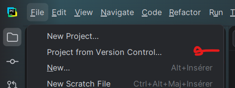
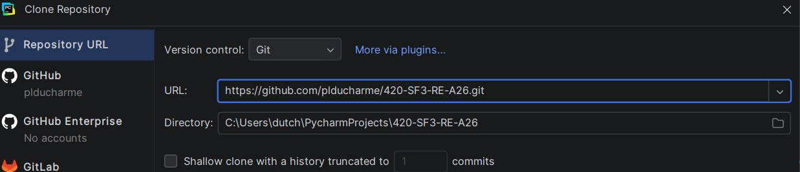

# 420-SF3-RE-A26
Dépôt du cours 420-SF3-RE Session Automne 2026

# Rappel: Instructions pour cloner le dépôt
1) Dans Pycharm, File → "Project from version control"

2) Dans le champ texte "URL", copier l'url du dépôt:
[https://github.com/plducharme/420-SF3-RE-A26.git](https://github.com/plducharme/420-SF3-RE-A26.git)

3) Cliquer sur "clone"
4) Une fois le clone terminé, créer un environnement virtuel
